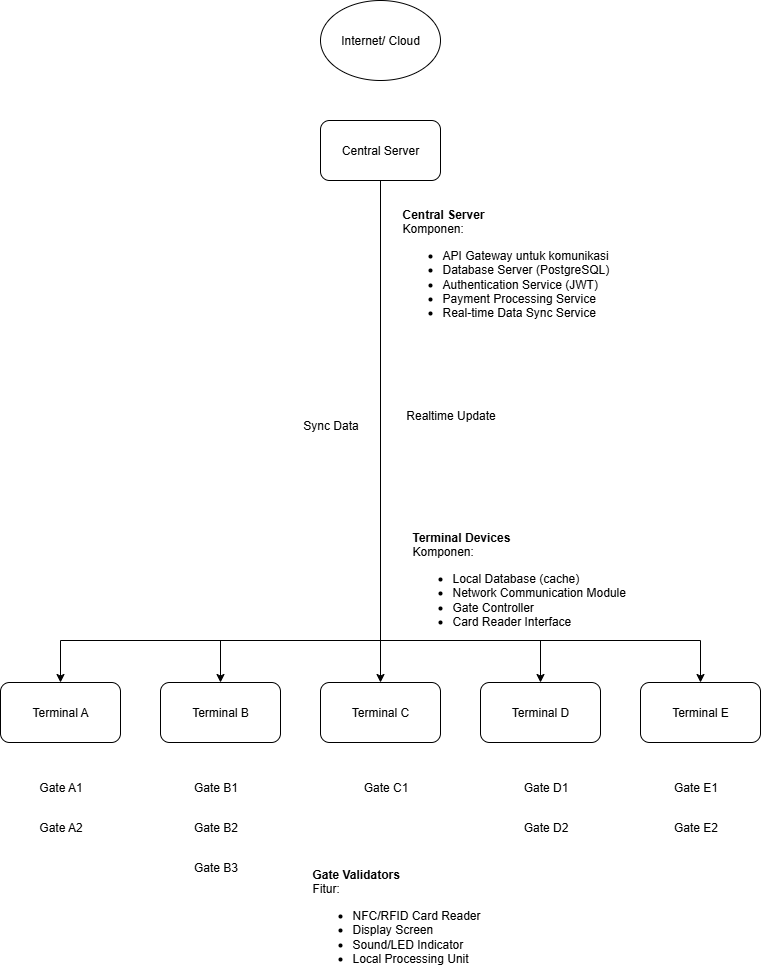
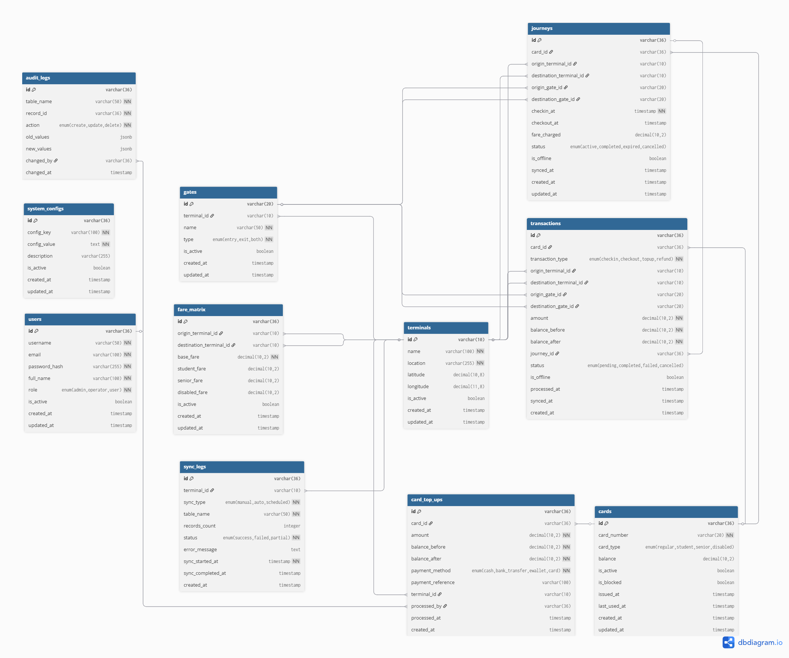

# Backend Development Test - Mitra Kasih Perkasa 2025

**Nama:** Muhammad Ariyanto
**Tanggal:** 8 Juli 2025
**Email:** mhm.ariyanto@gmail.com
**Phone:** 082245750310

---

## Instructions

Proyek ini merupakan hasil pengerjaan tes pengembangan backend untuk Mitra Kasih Perkasa. Tes ini mencakup empat bagian utama: Fundamental Test, System Design Test, Database Design Test, dan Skill Test.

### 1. Fundamental Test

Dibuat menggunakan bahasa pemrograman Golang dan diunggah ke Go Playground.

- **Deret Fibonacci:**

  - **Deskripsi:** Implementasi untuk menghasilkan deret Fibonacci.
  - **Link Go Playground:**
    [https://go.dev/play/p/JfmDQww7mKS](https://go.dev/play/p/JfmDQww7mKS)

- **Pola Segitiga Naik (Bintang):**

  - **Deskripsi:** Menggambar pola segitiga naik menggunakan logika pengulangan dan if/else.
  - **Link Go Playground:**
    [https://go.dev/play/p/YLgEGTxL7Nj](https://go.dev/play/p/YLgEGTxL7Nj)

- **Pola Diamond (Bintang):**

  - **Deskripsi:** Menggambar pola diamond (berlian) menggunakan logika pengulangan dan if/else.
  - **Link Go Playground:**
    [https://go.dev/play/p/ALdpINx86Lm](https://go.dev/play/p/ALdpINx86Lm)

- **Pola Bintang Belah Ketupat bergaris tengah:**
  - **Deskripsi:** Menggambar pola belah ketupat kosong didalam yang terbelah dengan garis.
  - **Link Go Playground:**
    [https://go.dev/play/p/Wxr2S5nf0sf](https://go.dev/play/p/Wxr2S5nf0sf)

### 2. System Design Test

Rancangan sistem E-Ticketing Transportasi Publik yang beroperasi 24 jam. Tarif ditentukan berdasarkan titik terminal check-in dan check-out. Terdapat 5 titik terminal dengan gate/gerbang validasi yang terhubung ke server. [cite_start]Pembayaran dilakukan menggunakan kartu prepaid yang mampu berjalan saat offline. [cite: 5, 6, 7]

**File Gambar Topologi:**

**Penjelasan Sistem E-Ticketing Transportasi Publik:**

**1. Arsitektur Sistem Saat Online (Ada Internet)**

- **Komponen Utama:**

  - **A. Central Server (Server Pusat):**
    - **Fungsi:** Mengatur semua data transaksi, tarif, dan sinkronisasi.
    - **Komponen:** API Gateway untuk komunikasi, Database Server (PostgreSQL), Authentication Service (JWT), Payment Processing Service, Real-time Data Sync Service.
  - **B. Terminal Devices (5 Terminal):**
    - [cite_start]**Identifikasi:** Terminal A, B, C, D, E dengan ID unik (T001-T005). [cite: 6]
    - [cite_start]**Fungsi:** Mengatur gate dan proses check-in/check-out. [cite: 6]
    - **Komponen:** Local Database (cache), Network Communication Module, Gate Controller, Card Reader Interface.
  - **C. Gate Validators (Multiple per Terminal):**
    - [cite_start]**Fungsi:** Membaca kartu prepaid dan validasi transaksi. [cite: 6, 7]
    * **Fitur:** NFC/RFID Card Reader, Display Screen, Sound/LED Indicator, Local Processing Unit.

- **Alur Kerja Saat Online:**
  - **Check-in Process:** Pengguna melakukan tap kartu → Gate membaca kartu → Terminal melakukan validasi awal → Data dikirim ke Central Server → Server memperbarui database → Respon dikirim kembali ke gate → Gate membuka/menutup.
  - **Check-out Process:** Pengguna melakukan tap kartu → Gate membaca kartu → Terminal menghitung tarif berdasarkan origin-destination → Data dikirim ke Central Server → Server memotong saldo dan memperbarui database → Respon dikirim kembali ke gate → Gate membuka/menutup.
  - **Real-time Synchronization:** Terminal mengirim data transaksi ke Central Server → Central Server memperbarui master database → Data disinkronkan ke semua terminal.

**2. Solusi Sistem Saat Offline (Tidak Ada Internet)**

- **Strategi Offline:**
  - **A. Local Data Storage:**
    - Setiap terminal memiliki database lokal (misalnya SQLite) yang menyimpan: Data tarif antar terminal, Daftar kartu yang valid, Transaksi pending, Konfigurasi sistem.
  - **B. Data Synchronization Strategy:**
    - **Online Mode:** Real-time sync dengan central server, memperbarui tarif, kartu baru, blacklist, dan mengunggah transaksi pending.
    - **Offline Mode:** Menggunakan data lokal (cache), menyimpan transaksi di antrean (queue), dan validasi menggunakan data terakhir yang diketahui (last known data).
  - **C. Offline Transaction Process:**
    - **Check-in Offline:** Pengguna melakukan tap kartu → Terminal memeriksa kartu di database lokal → Validasi saldo minimum (dari cache) → Mencatat waktu & lokasi check-in → Menyimpan transaksi di antrean pending → Gate membuka.
    - **Check-out Offline:** Pengguna melakukan tap kartu → Terminal memeriksa data check-in lokal → Menghitung tarif dari tabel tarif lokal → Memotong saldo dari cache → Memperbarui database lokal → Menyimpan transaksi di antrean pending → Gate membuka.
    - **Auto-sync When Online:** Ketika koneksi kembali, semua transaksi pending diunggah → Sinkronisasi dengan central server → Cache lokal diperbarui → Konflik (jika ada) diselesaikan.

**3. Fitur Keamanan dan Reliability**

- Memastikan data akan menjadi konsisten setelah sinkronisasi (Eventual Consistency).
- Resolusi konflik berdasarkan timestamp.
- Melakukan validasi data dengan penggunaan checksum untuk integritas data.
- Melakukan pencegahan check-in/check-out ganda (Double-tap Protection).
- Memberikan batas waktu maksimum perjalanan (Time-based Validation).
- Melakukan sinkronisasi kartu yang diblokir (Blacklist Sync).
- Memastikan jika satu terminal tidak berfungsi, yang lain tetap beroperasi (Terminal Redundancy).
- Melakukan backup data lokal di setiap terminal (Local Backup).
- Memastikan dapat otomatis terhubung kembali saat jaringan tersedia (Network Resilience).

**4. Skenario Penggunaan**

- **Skenario 1: Normal Operation (Online):** Pengguna check-in Terminal A → Perjalanan → Pengguna check-out Terminal C. Tarif: Rp 5.000 (A→C) berdasarkan matriks jarak.
- **Skenario 2: Offline Operation:** Terminal B offline → Pengguna check-in menggunakan cached data → Transaksi tersimpan lokal → Ketika online, sinkronisasi ke server.
- **Skenario 3: Partial Network Issue:** 2 Terminal online, 3 Terminal offline → Sistem tetap berjalan dengan data lokal → Sinkronisasi otomatis ketika koneksi pulih.

---

### 3. Database Design Test

**Deskripsi:**
Rancangan database telah dibuat dengan detail sesuai dengan analisa sistem pada bagian System Design. [cite_start]Desain ini dibuat menggunakan `dbdiagrams.io` untuk visualisasi skema dan menghasilkan script PostgreSQL. [cite: 9]

Saya belum memiliki pengalaman langsung dalam membuat script PostgreSQL DDL (Data Definition Language) yang berfungsi penuh, namun saya telah mencoba merancang skema database dengan maksimal. Desain ini mencakup semua entitas utama dan relasinya yang diperlukan untuk sistem E-Ticketing.

**File Gambar ERD / Link dbdiagrams.io:**

Link dbdiagrams.io: `https://dbdiagram.io/d/ticketing-686c8884f413ba3508bcaf88`
File Script PostgreSQL: [db-ticketing](ticketing.sql)

**Penjelasan Skema Database:**

Berikut adalah detail tabel-tabel yang dirancang untuk sistem E-Ticketing:

- **Table `users`:**
  - **Tujuan:** Manajemen pengguna untuk akses sistem (misalnya, admin, operator, user biasa).
  - **Kolom Penting:** `id` (UUID PK), `username` (unique), `email` (unique), `password_hash`, `full_name`, `role` (enum: 'admin', 'operator', 'user'), `is_active`, `created_at`, `updated_at`.
- **Table `terminals`:**
  - **Tujuan:** Master data untuk terminal/stasiun transportasi publik.
  - **Kolom Penting:** `id` (PK, contoh: 'T001'), `name`, `location`, `latitude`, `longitude`, `is_active`, `created_at`, `updated_at`.
- **Table `gates`:**
  - **Tujuan:** Master data untuk perangkat gerbang/validator di setiap terminal.
  - **Kolom Penting:** `id` (PK, contoh: 'G001'), `terminal_id` (FK ke `terminals.id`), `name`, `type` (enum: 'entry', 'exit', 'both'), `is_active`, `created_at`, `updated_at`.
- **Table `cards`:**
  - **Tujuan:** Master data untuk kartu prabayar (e.g., e-money).
  - **Kolom Penting:** `id` (UUID PK), `card_number` (unique), `card_type` (enum: 'regular', 'student', 'senior', 'disabled'), `balance`, `is_active`, `is_blocked`, `issued_at`, `last_used_at`, `created_at`, `updated_at`.
- **Table `fare_matrix`:**
  - **Tujuan:** Menyimpan matriks harga tarif antar terminal.
  - **Kolom Penting:** `id` (UUID PK), `origin_terminal_id` (FK ke `terminals.id`), `destination_terminal_id` (FK ke `terminals.id`), `base_fare`, `student_fare`, `senior_fare`, `disabled_fare`, `is_active`, `created_at`, `updated_at`.
- **Table `transactions`:**
  - **Tujuan:** Mencatat semua riwayat transaksi, termasuk check-in, check-out, top-up, dan refund.
  - **Kolom Penting:** `id` (UUID PK), `card_id` (FK ke `cards.id`), `transaction_type` (enum: 'checkin', 'checkout', 'topup', 'refund'), `origin_terminal_id`, `destination_terminal_id`, `origin_gate_id`, `destination_gate_id`, `amount`, `balance_before`, `balance_after`, `journey_id` (FK ke `journeys.id`), `status` (enum: 'pending', 'completed', 'failed', 'cancelled'), `is_offline`, `processed_at`, `synced_at`, `created_at`.
- **Table `journeys`:**
  - **Tujuan:** Melacak perjalanan individu dari check-in hingga check-out.
  - **Kolom Penting:** `id` (UUID PK), `card_id` (FK ke `cards.id`), `origin_terminal_id` (FK ke `terminals.id`), `destination_terminal_id` (FK ke `terminals.id`), `origin_gate_id` (FK ke `gates.id`), `destination_gate_id` (FK ke `gates.id`), `checkin_at`, `checkout_at`, `fare_charged`, `status` (enum: 'active', 'completed', 'expired', 'cancelled'), `is_offline`, `synced_at`, `created_at`, `updated_at`.
- **Table `card_top_ups`:**
  - **Tujuan:** Mencatat riwayat pengisian ulang saldo kartu.
  - **Kolom Penting:** `id` (UUID PK), `card_id` (FK ke `cards.id`), `amount`, `balance_before`, `balance_after`, `payment_method`, `payment_reference`, `terminal_id` (FK ke `terminals.id`), `processed_by` (FK ke `users.id`), `processed_at`, `created_at`.
- **Table `system_configs`:**
  - **Tujuan:** Menyimpan parameter konfigurasi sistem yang dinamis.
  - **Kolom Penting:** `id` (UUID PK), `config_key` (unique), `config_value`, `description`, `is_active`, `created_at`, `updated_at`.
- **Table `audit_logs`:**
  - **Tujuan:** Melacak perubahan penting pada data untuk tujuan audit.
  - **Kolom Penting:** `id` (UUID PK), `table_name`, `record_id`, `action` (enum: 'create', 'update', 'delete'), `old_values` (jsonb), `new_values` (jsonb), `changed_by` (FK ke `users.id`), `changed_at`.
- **Table `sync_logs`:**
  - **Tujuan:** Mencatat riwayat sinkronisasi data antara terminal dan server pusat.
  - **Kolom Penting:** `id` (UUID PK), `terminal_id` (FK ke `terminals.id`), `sync_type` (enum: 'manual', 'auto', 'scheduled'), `table_name`, `records_count`, `status` (enum: 'success', 'failed', 'partial'), `error_message`, `sync_started_at`, `sync_completed_at`, `created_at`.

---

### 4. Skill Test

**Deskripsi:**
Pengembangan API sederhana menggunakan Golang dengan dua endpoint utama: API Login (output JSON + JWT token) dan API Create Terminal (memerlukan Authorization Token dari JWT Login).

**Link Repository Github / Gitlab:**
`git@github.com:arikmhm/eticketing-backend.git`

**Catatan Mengenai Implementasi:**
Saya sedang dalam proses mempelajari Golang dan PostgreSQL, ini pengalaman saya pertama kali menggunakan keduanya. Oleh karena itu, untuk API ini, saya berfokus pada implementasi konsep dasar seperti otorisasi JWT dan struktur API.

- **API Login:**
  - **Deskripsi:** API untuk otentikasi pengguna dan mengembalikan output JSON beserta token JWT.
  - **Status Implementasi:** Telah diimplementasikan dengan JWT untuk otorisasi.
  - **Catatan:** Data pengguna untuk login saat ini disimulasikan dan disimpan di memori (`in-memory`) karena keterbatasan dalam integrasi penuh dengan database PostgreSQL pada tahap awal pembelajaran.
- **API Create Terminal:**
  - **Deskripsi:** API untuk membuat data terminal baru, dengan memerlukan Authorization Token dari JWT Login.
  - **Status Implementasi:** Fungsi API untuk menerima data terminal dan memvalidasi token JWT telah ada.
  - **Catatan:** Untuk persistent storage, data terminal saat ini disimpan dalam memori (`in-memory storage`) dan tidak terhubung langsung ke database PostgreSQL, mengingat waktu dan pengalaman saya yang masih terbatas dengan integrasi Golang dan PostgreSQL.
- **API Get Terminals (Tambahan):**
  - **Deskripsi:** API untuk mendapatkan daftar terminal yang telah dibuat (memerlukan Authorization Token).
  - **Status Implementasi:** Telah diimplementasikan untuk menampilkan terminal yang ada di penyimpanan `in-memory`.

**Link Export Postman:**
`backend-test.postman_collection.json`
